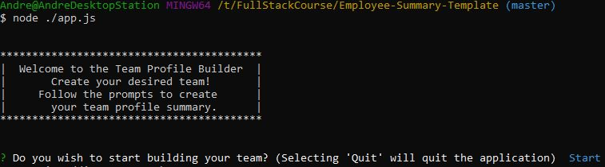
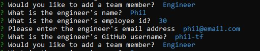
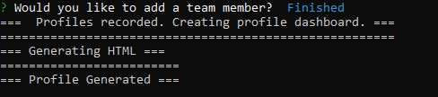
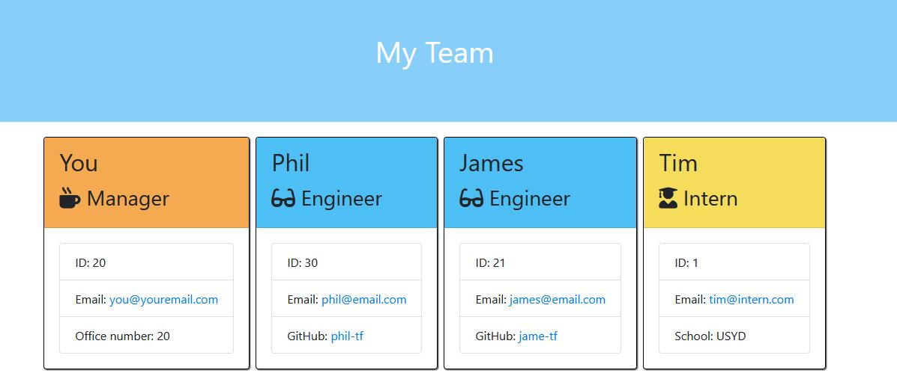

# Team Profile Generator

<br />

## Description

A Node CLI that takes in information about employees and generates a HTML webpage. This displays summaries for each employee. Designed with test driven development and OOP in mind. Easy way to keep track of team member details.

## Contents

- [Installation](#installation)
- [User Story](#user-story)
- [Usage](#usage)
- [Demonstration](#demonstration)
- [Tests](#Tests)
- [Screenshots](#screenshots)
- [Questions](<#questions-(FAQ)>)
- [Contact](#contact)
- [Author](#authors)
- [Acknowledgements](#acknowledgements)

## Installation

- [Node.js](https://nodejs.org/en/)
- [inquirer](https://www.npmjs.com/package/inquirer)
- [jest](https://jestjs.io/)
- run npm install for the npm packages before running the CLI

## User Story

```
As a manager
I want to generate a webpage that displays my team's basic info
so that I have quick access to emails and GitHub profiles
```

## Usage

1. Run

```
  npm i
```

2. Ensure command terminal is in correct directory
3. Run

```
node ./app.js
```

## Demonstration

- [Tutorial-Video](https://drive.google.com/file/d/1AJ7NADuEGr-LswTzgOcTKi_kHifzYDH2/view?usp=sharing)

## Tests

- Included in <a href="./test">test</a> folder.

## Screenshots

_Initiate application with start choice_



_First team member is always manager_


_Prompted to select further team members such as engineer_



_When finished is selected, html is rendered and generated_



_Demonstration video produced this team.html_



## Questions

- Submit questions to my contact details below.
- App runs in CLI.

## Contact

- Contact me with any questions on my email: agre.fun21@gmail.com or silver.grech@gmail.com

## Author

- Initial files to develop by Trilogy Education Services
- Andr&eacute; Grech - 26/10/2020

### Acknowledgements

- © 2019 Trilogy Education Services, a 2U, Inc. brand. All Rights Reserved.
